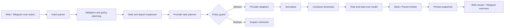

# Flight Hunter — целевая архитектура

## 1. Архитектурная позиция

Flight Hunter — self-hosted, invitation-only приложение для семьи и друзей. Оно не продаёт билеты и не притворяется единственным источником истины. Его задача:

- собрать разрешённые данные из нескольких источников;
- нормализовать предложения;
- найти дешёвые даты, соседние аэропорты и разумные комбинации;
- сохранять историю наблюдений;
- оценивать цену, длительность и риск;
- запускать live refresh только там, где это разрешено;
- отправлять полезные, не спамящие уведомления в Telegram;
- объяснять пользователю, почему вариант считается выгодным.

Архитектура — **модульный монолит с отдельными процессами**, а не набор микросервисов. Один репозиторий, одна доменная модель, отдельные runtime-процессы:

- `web` — Next.js UI/PWA;
- `api` — FastAPI REST/SSE;
- `worker` — фоновые задачи и scheduler;
- `bot` — Telegram webhook processor;
- `postgres` — PostgreSQL + PostGIS;
- `redis` — очередь, кэш и distributed locks;
- `object-storage` — опционально S3/MinIO для exports/fixtures;
- `reverse-proxy` — Caddy/Traefik;
- observability stack — включаемый profile.

Логический агентный слой не должен превращать систему в недетерминированный «рой». LLM используется для понимания естественного языка и объяснений, а поиск, ограничения, денежные расчёты, маршрутизация и alerts выполняются детерминированным кодом.

---

## 2. Рекомендуемый стек

Перед началом реализации coding agent проверяет актуальные stable/LTS версии и фиксирует их в ADR и lock-файлах. Базовый выбор:

### Backend

- Python 3.13+;
- FastAPI;
- Pydantic v2;
- SQLAlchemy 2 async;
- Alembic;
- PostgreSQL + PostGIS;
- Redis;
- Dramatiq или Celery для очередей; выбрать один после короткого ADR;
- APScheduler только как trigger producer, не как единственный durable scheduler;
- HTTPX;
- Tenacity или собственный retry policy;
- structlog;
- OpenTelemetry;
- Prometheus client;
- aiogram 3 для Telegram;
- pytest, Hypothesis, respx, testcontainers.

### Frontend

- Next.js App Router;
- TypeScript strict;
- React;
- Tailwind CSS;
- shadcn/ui или Radix primitives;
- TanStack Query;
- TanStack Table;
- React Hook Form + Zod;
- ECharts/Recharts для истории цен и матриц;
- MapLibre для карты аэропортов, если карта включена;
- Playwright для E2E собственного приложения;
- Vitest + Testing Library.

### Репозиторий и эксплуатация

- pnpm workspace или Turborepo;
- uv для Python dependencies;
- Docker Compose для self-host;
- GitHub Actions;
- pre-commit;
- Ruff, mypy/pyright, ESLint, Prettier;
- Renovate/Dependabot;
- Caddy для TLS и reverse proxy;
- Sentry-compatible error sink — опционально;
- Grafana/Prometheus/Loki — production profile.

Не вводить Kubernetes как обязательное условие. Helm/Terraform можно добавить как дополнительный deployment target после полностью рабочего Docker Compose.

---

## 3. Структура монорепозитория

```text
flight-hunter/
├─ AGENTS.md
├─ README.md
├─ Makefile
├─ compose.yaml
├─ compose.observability.yaml
├─ .env.example
├─ .github/
│  └─ workflows/
├─ apps/
│  ├─ web/
│  ├─ api/
│  ├─ worker/
│  └─ bot/
├─ packages/
│  ├─ domain/                 # чистая доменная логика
│  ├─ application/            # use cases / orchestration
│  ├─ persistence/            # SQLAlchemy, migrations, repositories
│  ├─ providers/              # адаптеры авиаданных
│  │  ├─ aviasales_data/
│  │  ├─ aviasales_search/
│  │  ├─ skyscanner_indicative/
│  │  ├─ skyscanner_live/
│  │  ├─ duffel/
│  │  ├─ deal_feed/
│  │  ├─ manual/
│  │  └─ fake/
│  ├─ geo/                    # аэропорты, PostGIS, nearby
│  ├─ money/                  # FX, minor units, fees
│  ├─ ranking/
│  ├─ itinerary_engine/
│  ├─ price_intelligence/
│  ├─ notifications/
│  ├─ policy/
│  ├─ llm/
│  └─ contracts/              # JSON schemas / generated clients
├─ docs/
│  ├─ adr/
│  ├─ api/
│  ├─ runbooks/
│  ├─ provider-contracts/
│  ├─ privacy/
│  └─ threat-model.md
├─ fixtures/
│  ├─ providers/
│  └─ demo/
└─ scripts/
```

Python-пакеты могут быть размещены в `src/flight_hunter/...`; важна граница модулей, а не буквальная структура.

---

## 4. Ключевой слой: Provider Policy Engine

### 4.1. Почему он обязателен

Одинаковый HTTP client для разных поставщиков недостаточен. Правила Aviasales Search, Aviasales Data, Skyscanner Live и Duffel различаются. Ограничения должны предотвращаться кодом.

### 4.2. Модель политики

```python
class ProviderPolicy:
    provider_id: str
    policy_version: str
    terms_url: str
    terms_verified_at: datetime

    enabled: bool
    credentials_present: bool
    access_approved: bool

    data_kind: Literal["cached", "indicative", "live", "bookable", "feed"]
    background_requests_allowed: bool
    user_action_required: bool
    merge_with_other_sources_allowed: bool
    persist_raw_results_allowed: bool
    persist_normalized_results_allowed: bool
    booking_link_requires_click: bool
    preload_booking_links_allowed: bool
    server_side_only: bool
    real_user_ip_required: bool

    max_requests_per_minute: int | None
    max_requests_per_hour_per_user_ip: int | None
    cache_ttl_seconds: int
    result_ttl_seconds: int | None
    max_concurrent_requests: int

    supports_flexible_dates: bool
    supports_nearby_airports: bool
    supports_multi_city: bool
    supports_one_way: bool
    supports_round_trip: bool
    supports_baggage: bool
    supports_fare_rules: bool

    notes: str
```

### 4.3. UserActionGrant

Для user-initiated API каждый запуск требует grant:

```python
class UserActionGrant:
    id: UUID
    user_id: UUID
    provider_id: str
    action_type: str
    request_fingerprint: str
    issued_at: datetime
    expires_at: datetime
    source: Literal["web_click", "telegram_callback", "api_request"]
    consumed_at: datetime | None
```

Grant:

- создаётся только при реальном действии пользователя;
- одноразовый;
- связан с конкретными параметрами поиска;
- имеет короткий TTL;
- проверяется policy guard до вызова провайдера;
- не может создаваться worker-ом.

### 4.4. Изоляция результатов

`SearchRun` имеет `merge_scope`:

- `MERGEABLE` — разрешено нормализовать и сравнивать с другими источниками;
- `PROVIDER_ISOLATED` — отдельная выдача, не попадает в общий ranker;
- `PRIVATE_TRANSIENT` — хранится только с минимальным TTL.

Aviasales Search всегда `PROVIDER_ISOLATED`.

---

## 5. Каноническая модель авиапредложения

### 5.1. Деньги

- хранить сумму в integer minor units;
- хранить ISO 4217 currency;
- отдельно `provider_amount`, `normalized_amount`, `fx_rate`, `fx_observed_at`;
- total price всегда относится к явно указанному набору пассажиров;
- комиссии карты/FX моделируются отдельно и не смешиваются с provider fare без label.

### 5.2. Времена

- все timestamps в БД — timezone-aware UTC;
- для сегмента хранить local datetime и IANA timezone origin/destination;
- длительность вычислять по UTC, а показывать локальное время;
- DST покрыть тестами.

### 5.3. Основные сущности

#### User / Household

- `users`;
- `households`;
- `household_memberships` с ролями owner/admin/member/viewer;
- invitation-only registration;
- per-user locale, timezone, base currency, Telegram preferences.

#### Airport

- IATA/ICAO/local code;
- name, municipality, country, region;
- point geography;
- timezone;
- commercial relevance;
- active/closed/type;
- metro group;
- source and source timestamp;
- admin overrides.

#### SearchIntent

- typed normalized user request;
- one-way/round-trip/multi-city;
- origin and destination sets;
- exact or flexible dates;
- trip length range;
- passengers;
- cabin;
- baggage;
- nearby radius;
- max stops;
- overnight/self-transfer/airport-change preferences;
- budget;
- weights;
- provider selection.

#### SearchRun / ProviderRun

- request fingerprint;
- actor/user action grant;
- execution mode;
- provider policy snapshot;
- status and timings;
- quota cost;
- errors classified as transient/permanent/policy;
- raw payload reference only if storage allowed.

#### Offer

- provider offer id;
- source and observed time;
- expiry;
- total money;
- passengers;
- fare products;
- baggage;
- agent/seller;
- itinerary references;
- booking action descriptor, not necessarily a pre-generated URL;
- freshness.

#### Itinerary / Slice / Segment

- itinerary type: single-ticket, split-ticket, self-transfer, hidden-city research;
- slices;
- segments;
- marketing and operating carrier;
- flight number;
- aircraft when available;
- origin/destination;
- departure/arrival;
- layover;
- terminal;
- PNR grouping;
- airport-change flag;
- overnight flag;
- protected connection flag;
- visa/entry unknown flag.

#### PriceSnapshot

- canonical offer fingerprint;
- source;
- observed amount;
- freshness;
- availability confidence;
- normalized money;
- query context;
- immutable append-only record.

#### Watch

- owner/household;
- search intent;
- schedule policy;
- alert rules;
- enabled/paused;
- allowed providers;
- last successful run;
- next eligible run;
- quiet hours;
- Telegram destinations.

#### Alert / NotificationDelivery

- reason code;
- baseline and current value;
- score and explanation inputs;
- dedupe key;
- cooldown/hysteresis state;
- rendered message version;
- delivery attempts;
- Telegram message id;
- click tracking where permitted.

---

## 6. Поисковый конвейер



### 6.1. Intent parser

LLM допускается для фраз вида:

- «из Варшавы в Японию на 10–14 дней в октябре, можно из Берлина, багаж один»;
- «лови до 1800 PLN, максимум одна пересадка».

Но LLM возвращает только `SearchIntentDraft` по JSON Schema. Затем deterministic validator:

- разрешает неоднозначные города;
- проверяет даты;
- нормализует валюту;
- запрашивает недостающие данные через UI/bot;
- не выдумывает аэропорты, цены или рейсы.

Без LLM все функции доступны через обычную форму.

### 6.2. Expansion planner

#### Flexible dates

Для ±3 дней round trip теоретически 49 комбинаций. Нельзя слепо делать 49 live-запросов. Алгоритм:

1. Получить cached/indicative matrix одним или минимальным числом запросов.
2. Отфильтровать невозможные stay lengths.
3. Оценить top candidates по цене и пользовательским ограничениям.
4. Показать heatmap.
5. Live refresh выполнять только для выбранной пользователем комбинации или top-N, если договор прямо разрешает.

#### Nearby airports

1. Resolve origin/destination to coordinates/metro groups.
2. PostGIS `ST_DWithin` для радиуса, по умолчанию до 150 км.
3. Отфильтровать аэропорты без IATA, закрытые и коммерчески нерелевантные.
4. Рассчитать great-circle distance.
5. Добавить приблизительные ground time/cost с confidence label.
6. Не считать далёкий аэропорт выгодным, если наземный трансфер съедает экономию.

#### Candidate budget

Planner получает request budget:

- max provider calls;
- max date combinations;
- max airport pairs;
- max total execution time;
- max monetary API cost, если провайдер тарифицируется.

Использовать beam search: сначала дешёвые/вероятные комбинации, затем расширение при наличии бюджета.

### 6.3. Provider task planner

На каждый candidate формирует задачу с:

- provider;
- query parameters;
- execution mode;
- `UserActionGrant`, если требуется;
- quota reservation;
- idempotency key;
- deadline;
- result merge scope.

### 6.4. Нормализация

Каждый adapter возвращает provider-specific DTO. Mapper создаёт canonical `OfferCandidate` и сохраняет:

- provenance каждого поля;
- неизвестные значения как `unknown`, не `false`;
- raw field bag только если policy разрешает;
- parsing warnings.

### 6.5. Дедупликация

Canonical fingerprint строится из:

- ordered segments;
- operating carrier + flight number;
- local departure date/time;
- airports;
- cabin;
- fare family;
- baggage;
- seller/agent;
- passenger mix.

Два предложения с одинаковым itinerary, но разными продавцами или условиями, не теряются: UI группирует их, но хранит отдельные offers.

---

## 7. Itinerary Engine

### 7.1. Виды маршрутов

- прямой;
- обычная пересадка на одном билете;
- multi-city/open jaw;
- комбинация one-way билетов;
- split ticket;
- self-transfer;
- positioning flight;
- airport change;
- hidden-city research — отдельный experimental режим.

### 7.2. Графовая модель

- vertex: `(airport, timestamp window, state)`;
- edge: flight offer slice или ground transfer;
- edge attributes: price, duration, provider, PNR, baggage, expiry, risk;
- path constraints: minimum connection, maximum total duration, max stops, airport-change policy, overnight policy, visa/entry unknown, terminal transition.

Использовать constrained k-shortest paths или beam search, а не полный перебор.

### 7.3. Minimum connection

Если provider не даёт защищённость/Minimum Connection Time:

- не утверждать, что пересадка гарантирована;
- использовать консервативные configurable defaults;
- для self-transfer добавлять buffer по типу аэропорта, domestic/international, terminal/airport change и baggage;
- высокий риск исключать из default results.

### 7.4. Split tickets

Split-ticket candidate должен содержать:

- отдельные PNR/заказы;
- общий total price;
- baggage recheck requirement;
- connection buffer;
- missed-connection risk;
- immigration/visa uncertainty;
- отдельные правила изменения/возврата;
- явное сравнение с лучшим single-ticket вариантом.

Показывать только если экономия превышает configurable minimum после наземных расходов и risk penalty.

### 7.5. Hidden-city research

Feature flag выключен по умолчанию. Режим:

- не включается в общий «Лучший» рейтинг;
- требует явного подтверждения предупреждения;
- не автоматизирует покупку;
- не предлагает checked baggage;
- показывает риск аннулирования последующих сегментов, проблем с обратным билетом, rerouting и последствий по правилам авиакомпании;
- хранит событие acknowledgement;
- называется «исследовательский вариант», а не «лайфхак без риска».

---

## 8. Ranking и объяснимость

### 8.1. Pareto frontier

Сначала исключить dominated варианты по:

- total trip cost;
- total duration;
- number of stops;
- risk;
- freshness;
- baggage fit.

Затем weighted score по профилю пользователя.

### 8.2. Компоненты score

```text
value_score =
  w_price * normalized_price
+ w_duration * normalized_duration
+ w_stops * stop_penalty
+ w_risk * risk_penalty
+ w_airport * ground_transfer_penalty
+ w_baggage * baggage_penalty
+ w_freshness * freshness_penalty
+ w_schedule * departure_time_penalty
```

Не использовать «магические» веса без отображения. Пользователь может выбрать preset:

- Самый дешёвый;
- Лучший баланс;
- Самый быстрый;
- Минимум риска;
- С багажом;
- Семейный.

### 8.3. Total trip cost

Помимо fare:

- baggage fees, если известны;
- seat/ancillary — отдельно и только если известны;
- card FX/foreign transaction fee по пользовательской настройке;
- estimated ground transfer;
- overnight hotel estimate — optional и помечен как estimate;
- positioning flight;
- self-transfer contingency.

Не добавлять неизвестные расходы как точные числа. Использовать ranges/confidence.

### 8.4. Explainability

Для каждого результата deterministic explanation facts:

- «на 18% дешевле медианы ваших 42 наблюдений»;
- «на 320 PLN дешевле лучшего single-ticket, но два PNR»;
- «аэропорт в 112 км; оценка трансфера 2 ч 10 мин»;
- «цена cached, наблюдалась 5 часов назад»;
- «тариф без зарегистрированного багажа».

LLM может превратить facts в читаемый текст, но не добавляет новые утверждения.

---

## 9. Price Intelligence

### 9.1. История

Сохранять append-only snapshots. Не перезаписывать прошлые цены. Для одинакового наблюдения допускается compaction с count, но исходная временная последовательность должна восстанавливаться.

### 9.2. Buy-now score

Не существует hardcoded «самого дешёвого вторника в 02:00». Оценка строится по данным конкретного watch:

- percentile текущей цены;
- robust z-score относительно медианы/MAD;
- recent slope;
- volatility;
- days to departure;
- число наблюдений;
- freshness;
- cross-source confirmation;
- seat/fare expiry, если известно.

При недостатке данных показывать `INSUFFICIENT_DATA`, а не уверенный совет.

### 9.3. Suspected error fare

Anomaly detector:

```text
anomaly_score =
  route_price_ratio_score
+ historical_robust_z_score
+ cross_market_gap_score
+ cross_provider_confirmation_score
- stale_data_penalty
- impossible_itinerary_penalty
- missing_fees_penalty
```

Требования:

- сравнивать одинаковый passenger mix/cabin/baggage;
- исключать ошибочную валюту и one-way/round-trip mismatch;
- проверять, что itinerary валиден;
- по возможности делать разрешённый refresh;
- label: «подозрение на аномально низкую цену»;
- никогда не обещать, что билет будет выписан;
- уведомление должно советовать проверить условия и не строить невозвратные планы до ticketing confirmation.

### 9.4. Горящие направления

`DealScanner` работает только на источниках, разрешающих background discovery. Он не перебирает весь мир live-запросами. Стратегия:

1. Пользователь задаёт origin set, регионы, период, длительность, бюджет.
2. Получить popular/alternative directions и cached/indicative matrix.
3. Сформировать ограниченный candidate set.
4. Сравнить с собственной историей.
5. Отправить alert при превышении deal threshold.
6. Предложить кнопку «Проверить live», которая создаёт UserActionGrant.

---

## 10. Watch Scheduler

### 10.1. Принципы

- provider policy выше пользовательского желания;
- adaptive interval;
- quota-aware;
- jitter;
- exponential backoff;
- circuit breaker;
- distributed lock;
- idempotency;
- dead-letter queue;
- quiet hours относятся к доставке, а не обязательно к сбору;
- не выполнять бессмысленные запросы после вылета/истечения watch.

### 10.2. Пример базовой частоты

Только для источников, разрешающих background:

- >120 дней: раз в 24 часа;
- 61–120 дней: раз в 12 часов;
- 15–60 дней: раз в 6 часов;
- 3–14 дней: раз в 2 часа;
- <72 часов: раз в 1 час только если provider policy и quota это допускают;
- cached API всё равно не опрашивать чаще, чем обновляется полезная информация.

Это defaults, а не обещание. Scheduler учитывает `cache_ttl`, `last_modified`, quota и отсутствие изменений.

### 10.3. Alert hysteresis

Новый alert только если:

- цена ниже absolute threshold; или
- падение больше X%; или
- новый historical low; или
- deal score пересёк threshold;
- и изменение материально относительно последнего отправленного;
- и cooldown истёк, кроме нового сильного рекорда.

Дедупликация по `(watch, canonical itinerary group, reason bucket, price bucket)`.

---

## 11. Telegram

### 11.1. Production mode

- webhook через HTTPS;
- проверка `X-Telegram-Bot-Api-Secret-Token`;
- idempotency по `update_id`;
- long polling только для local development;
- token только в secret store/env;
- bot не доверяет Telegram username как идентификатору аккаунта.

### 11.2. Linking

1. Авторизованный web-пользователь генерирует одноразовый link code.
2. Нажимает deep link `/start <code>`.
3. Backend связывает Telegram user id с account.
4. Code одноразовый и короткоживущий.
5. В настройках можно отозвать связь.

### 11.3. Команды

- `/start`;
- `/search` — guided flow;
- `/watch` — создать отслеживание;
- `/watches`;
- `/pause` и `/resume`;
- `/deals`;
- `/settings`;
- `/link`;
- `/help`.

Основной UX — inline keyboards и Web App/deep links, а не длинные команды.

### 11.4. Уведомление

Должно помещать главное в первый экран:

```text
🔥 Новый минимум: WAW → NRT
2 184 PLN за 2 пассажиров · −17% от медианы
12–25 октября · 1 пересадка · 16ч 40м
Источник: cached, наблюдалось 18 минут назад
Багаж: ручная кладь; checked bag неизвестен

[Открыть сравнение] [Проверить live] [Не уведомлять 24ч]
```

Не отправлять booking link заранее, если политика провайдера требует генерацию после клика.

---

## 12. Web UI

### 12.1. Основные экраны

1. **Dashboard**
   - активные watches;
   - лучшие изменения;
   - provider health;
   - новые deals;
   - ближайшие поездки.

2. **Search**
   - structured form + natural-language input;
   - airport/city autosuggest;
   - date flexibility;
   - trip length;
   - passengers/baggage/cabin;
   - nearby radius;
   - risk preferences;
   - provider selection with policy explanations.

3. **Results**
   - progress via SSE;
   - tabs best/cheapest/fastest/lowest risk;
   - separate provider-isolated workspace;
   - date heatmap;
   - grouped sellers;
   - full segment details;
   - freshness/provenance labels;
   - compare drawer;
   - create watch.

4. **Watch detail**
   - price history;
   - alert timeline;
   - best current options;
   - scheduler status;
   - thresholds;
   - pause/resume/archive.

5. **Deals**
   - anomaly/deal feed;
   - filters by origin, region, dates, budget;
   - confidence and caveats.

6. **Settings**
   - user profile;
   - currency/timezone/locale;
   - Telegram;
   - quiet hours;
   - card FX fee;
   - risk presets.

7. **Admin**
   - invitations;
   - providers and policy status;
   - credentials presence, never plaintext;
   - quotas and circuit breakers;
   - job health;
   - data imports;
   - audit log;
   - backup status.

### 12.2. UX требования

- responsive PWA;
- WCAG AA baseline;
- keyboard navigation;
- dark/light mode;
- RU and EN from day one, locale architecture готова к PL;
- skeleton/progress without fake results;
- errors explain provider failure and next action;
- cached/live distinction visible, not hidden in tooltip;
- no dark patterns around booking buttons.

---

## 13. API surface

Примерные endpoints:

```text
POST   /api/v1/auth/invitations
POST   /api/v1/telegram/link-codes
POST   /api/v1/searches
GET    /api/v1/searches/{id}
GET    /api/v1/searches/{id}/events          # SSE
POST   /api/v1/searches/{id}/live-refresh    # user action grant
POST   /api/v1/offers/{id}/booking-action    # click-gated
GET    /api/v1/airports/autocomplete
GET    /api/v1/airports/nearby
POST   /api/v1/watches
GET    /api/v1/watches
GET    /api/v1/watches/{id}
PATCH  /api/v1/watches/{id}
POST   /api/v1/watches/{id}/pause
POST   /api/v1/watches/{id}/resume
GET    /api/v1/watches/{id}/history
GET    /api/v1/deals
GET    /api/v1/providers
GET    /api/v1/admin/providers/health
POST   /api/v1/admin/imports/airports
POST   /api/v1/privacy/export
DELETE /api/v1/account
```

Все mutating endpoints поддерживают idempotency key, где это разумно. OpenAPI генерирует frontend client.

---

## 14. Безопасность и приватность

- invitation-only;
- Argon2id для паролей, если password auth включён;
- предпочтительно OIDC/passkeys/magic link;
- secure, HTTP-only, SameSite cookies;
- CSRF protection;
- RBAC на household/admin boundaries;
- provider secrets зашифрованы at rest или передаются через secret manager;
- secrets никогда не попадают в frontend, logs, fixtures, exports;
- outbound host allowlist для provider adapters;
- защита от SSRF;
- timeout/size limits для HTTP;
- signed webhook secrets;
- audit log для admin/provider changes;
- rate limits на auth/search/Telegram actions;
- dependency and secret scanning;
- encrypted backups;
- data export/delete;
- configurable retention для raw provider payloads;
- threat model в репозитории.

---

## 15. Observability

### Метрики

- search latency per provider;
- provider error rate;
- 429 rate;
- quota remaining;
- cache hit ratio;
- scheduler lag;
- watch success age;
- offers normalized/rejected;
- alert count/dedupe count;
- Telegram delivery failures;
- SSE active sessions;
- DB pool saturation.

### Логи

- JSON structured;
- correlation id, search run id, provider run id;
- no raw token, PII, full booking URL or card data;
- policy denial logged as event, not exception noise.

### Tracing

HTTP request → planner → provider calls → normalization → ranking → notification.

### Runbooks

- provider returns 429;
- provider schema changed;
- Telegram webhook broken;
- scheduler backlog;
- airport import failed;
- database restore;
- secret rotation.

---

## 16. Testing

### Unit

- money conversions/minor units;
- date expansion;
- nearby airport selection;
- itinerary graph constraints;
- risk score;
- ranking;
- anomaly detection;
- policy guard;
- alert hysteresis;
- timezone/DST.

### Property-based

- no itinerary arrives before it departs in UTC;
- no connection violates configured buffer;
- rank score finite for incomplete data;
- currency round-trip error bounded;
- dedupe stable under provider ordering;
- policy guard never permits background call when disallowed.

### Provider contract

- recorded/sanitized fixtures;
- schema validation;
- unknown fields tolerated;
- required field disappearance fails clearly;
- 429/retry-after;
- timeout/partial results;
- expired offers;
- no live calls in CI.

### Integration

- PostgreSQL/PostGIS + Redis via testcontainers;
- migrations up/down or forward-only verification;
- worker idempotency;
- Telegram webhook secret;
- SSE event order;
- provider policy snapshots.

### E2E

- invite → sign in;
- create search;
- view matrix;
- create watch;
- fake provider price drop;
- Telegram fake sink receives one alert;
- pause/resume;
- booking click gate;
- admin disables provider;
- RU/EN and mobile viewport.

### Coverage gates

- domain/policy/ranking/itinerary modules: ≥85%;
- backend total: ≥75%;
- frontend critical flows covered; numeric coverage secondary to meaningful assertions.

---

## 17. Deployment

`docker compose up --build` должен запускать:

- web;
- api;
- worker;
- bot (disabled gracefully without token or fake mode);
- postgres/postgis;
- redis;
- reverse proxy;
- optional fake provider/demo seeder.

Production checklist:

- TLS;
- strong secrets;
- external volumes;
- scheduled backups and restore drill;
- health/readiness endpoints;
- migrations as explicit release step;
- image pinning by digest or immutable tag;
- non-root containers;
- resource limits;
- restart policies;
- log rotation;
- alerting.

---

## 18. Архитектурные запреты

- Не связывать домен с конкретным provider response.
- Не вызывать live API из frontend.
- Не хранить деньги как float.
- Не сравнивать цены без passenger/cabin/baggage normalization.
- Не запускать 49 live-поисков для ±3 дней автоматически.
- Не объединять provider-isolated results.
- Не создавать booking link до пользовательского клика, если запрещено.
- Не выдавать cached цену за live.
- Не использовать LLM для арифметики, маршрутизации или policy decisions.
- Не делать scraping fallback «на всякий случай».
- Не обходить CAPTCHA/антибот/географические ограничения.
- Не отправлять повторяющиеся Telegram alerts без material change.
- Не оставлять TODO, fake implementation или мок в production path.
